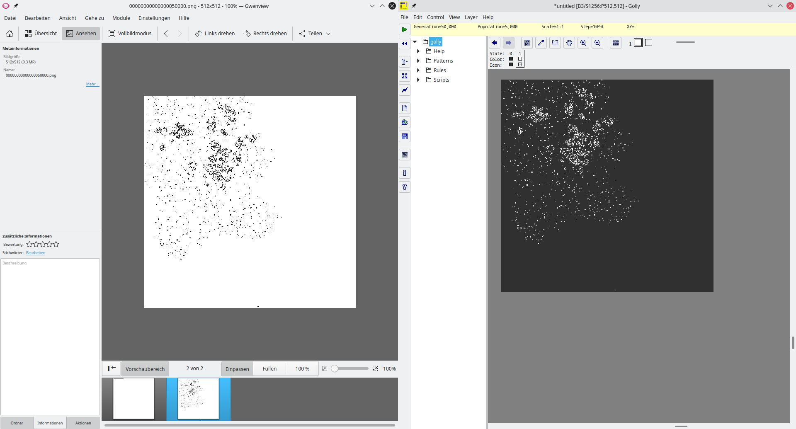

proof of concept
================
To make sure that simple_cells works as intended, this proof of concept was created using the following method and parameters:
* seed.json: `"rulestring": "B3/S1256", "n": 0`
* prefs.json: `"snapshots": 50000`
* `seed512.png` was copied to `seed.png`, overwriting the file.
* simple_cells was run until it spawned `00000000000000050000.png`.
* The same seed was copied into Golly (http://golly.sourceforge.net/).
* The rulestring in Golly was set to: `B3/S1256:P512,512`
* Golly shows the same generation 50000, as can be seen in the screenshot.

